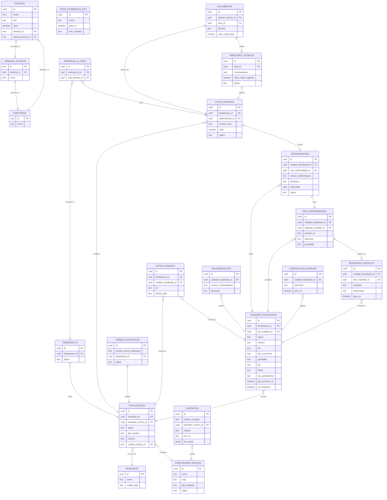

# 📖 Documentação Técnica e Funcional - Sistema AGEMS

## 🚀 1. Stack de Desenvolvimento e Versões

A tabela abaixo descreve as principais tecnologias, frameworks e bibliotecas utilizadas no ecossistema da aplicação, com suas respectivas versões identificadas nos arquivos de configuração do projeto:

| Categoria | Tecnologia / Biblioteca | Versão | Função / Escopo no Projeto |
|:---|:---|:---|:---|
| **Core Frontend** | React | `^18.2.0` | Biblioteca base para a construção das interfaces reativas do usuário. |
| **Core Frontend** | Vite | `^6.1.0` | Bundler e servidor de desenvolvimento de alta performance. |
| **Roteamento** | React Router DOM | `^6.26.0` | Gerenciador de rotas e navegação da SPA. |
| **Estilização** | Tailwind CSS | `^3.4.17` | Framework utilitário de CSS para design system corporativo. |
| **Gerenciamento de Estado** | TanStack React Query | `^5.84.1` | Gerenciamento de cache, sincronização e requisições HTTP assíncronas. |
| **Banco Local (Offline)** | Dexie.js | `^4.3.0` | Wrapper robusto de IndexedDB para persistência de dados local offline-first. |
| **Backend as a Service** | Supabase JS | `^2.97.0` | SDK oficial para autenticação, banco PostgreSQL remoto e storage. |
| **Mapas & Geoprocessamento**| Leaflet & React Leaflet | `^1.9.4` / `^4.2.1` | Visualização de mapas georreferenciados em campo e plotagem de KMLs. |
| **Processamento Geo** | @turf/turf | `^7.3.5` | Cálculos espaciais (ex: detecção do KM de rodovia mais próximo). |
| **Manipulação de PDF** | jsPDF | `^4.2.0` | Geração client-side de recibos e resumos de vistoria. |
| **Exportação de Dados** | xlsx (SheetJS) | `^0.18.5` | Exportação de checklists e constatações para planilhas. |
| **Validação** | Zod | `^3.24.2` | Validação estática e em tempo de execução de esquemas de dados. |
| **Formulários** | React Hook Form | `^7.54.2` | Gestão de formulários e validações de input em campo. |
| **Interface UI (Shadcn)** | Radix UI (Vários Componentes) | Variável | Conjunto de primitivos de acessibilidade (Dropdown, Dialog, Switch, etc). |
| **Animações** | Framer Motion | `^11.16.4` | Micro-animações e transições fluidas da interface. |
| **Linter / Qualidade** | ESLint | `^9.7.0` | Análise estática de qualidade de código. |

---

## 🧭 2. Organização Arquitetural em Módulos por Diretoria

O software é estruturado de forma modular e isolada para atender aos escopos de regulação e fiscalização das Diretorias finalísticas da **AGEMS**:

*   **DSB (Diretoria de Saneamento Básico e Resíduos Sólidos):**
    *   **Foco:** Fiscalização de campo baseada em checklists detalhados e estruturados de ativos de saneamento (ETAs, ETEs, Reservatórios, etc.).
    *   **Câmaras Técnicas:**
        *   `catesa` (Câmara Técnica de Saneamento)
        *   `caters` (Câmara Técnica de Resíduos Sólidos)
        *   `cres` (Câmara Técnica de Regulação Econômica do Saneamento)
*   **DTR (Diretoria de Transportes, Rodovias, Ferrovias, Portos e Aeroportos):**
    *   **Foco:** Fiscalização de rodovias concedidas através do registro dinâmico de ocorrências na malha viária, integrado a mapas georreferenciados e trajetórias em formato KML.
    *   **Câmaras Técnicas:**
        *   `catransp` (Câmara Técnica de Transporte)
        *   `caterf` (Câmara Técnica de Rodovias e Ferrovias)
        *   `catefis` (Câmara Técnica de Fiscalização)
        *   `cret` (Câmara Técnica de Regulação Econômica)

Cada usuário é atrelado a uma **Diretoria** e a uma **Câmara Técnica** em seu cadastro ([profiles](file:///c:/Users/jsilva/Documents/AGEMS/antigravity/fiscdsbagems/ESTRUTURA_BANCO_DADOS.md#211-profiles)), ditando quais rotas, formulários de preenchimento, menus laterais e dados RLS serão renderizados/acessados.

---

## 📊 3. Desenho Entidade-Relacionamento (DER)

Abaixo está representado o diagrama lógico de relacionamentos do banco de dados unificado do Supabase/PostgreSQL através de notação Mermaid.



---

## 🗂️ 4. Dicionário de Dados Completo

*Consulte a modelagem detalhada no arquivo de mapeamento do banco de dados: [ESTRUTURA_BANCO_DADOS.md](file:///c:/Users/jsilva/Documents/AGEMS/antigravity/fiscdsbagems/ESTRUTURA_BANCO_DADOS.md).*

---

## ⚙️ 5. Regras de Integridade e Invariantes do Negócio

A consistência jurídica e técnica do sistema é controlada rigidamente por restrições a nível de banco de dados (Check Constraints, Triggers e Unique Keys) e motor do cliente:

1.  **Impossibilidade de Duplicidade de Código de Unidades:**
    *   A tabela `unidades_fiscalizadas` possui a restrição `unique_unidade_por_fiscalizacao_codigo` garantindo que não existam dois registros com o mesmo código identificador dentro da mesma vistoria, prevenindo sobreposição de dados de checklists.
2.  **Rastreabilidade do Georreferenciamento:**
    *   Toda foto de campo inserida na tabela `fotos_evidencia` deve possuir latitude e longitude nos metadados EXIF. Se tiradas pelo aplicativo, são extraídas via API do navegador; se inseridas sem localização precisa, o app emite alertas ao usuário e registra a ocorrência como pendente de georreferenciamento confiável.
3.  **Cálculo Automático de Prazos Fatais:**
    *   As determinações têm seu prazo de vencimento (`data_limite`) calculado dinamicamente no momento da inserção: `data_limite := data_geracao + prazo_dias`. Se a concessionária não responder a tempo, a determinação muda automaticamente o status para `nao_atendida` via rotinas agendadas no Supabase.
4.  **Consistência Temporal da Defesa:**
    *   A tabela `termos_notificacao` possui o campo booleano `recebida_no_prazo`, que é preenchido através da validação: `data_recebimento_resposta <= data_maxima_resposta`. Caso a data seja superior, a manifestação é aceita, mas sinalizada como intempestiva para efeitos jurídicos.
5.  **Ciclo de Vida Fechado de Não Conformidades (NC):**
    *   Uma NC gerada automaticamente a partir de um checklist respondido como "NÃO" não pode ser excluída de forma isolada. A exclusão ou modificação dela só é permitida por meio da reabertura técnica da fiscalização ([reabrir_fiscalizacao](file:///c:/Users/jsilva/Documents/AGEMS/antigravity/fiscdsbagems/ESTRUTURA_BANCO_DADOS.md#31-finalizar_fiscalizacaop_fiscalizacao_id-uuid)) e alteração do checklist de origem.

---

## 📋 6. As Fiscalizações Existentes no App

O sistema atende a dois grandes grupos operacionais regulatórios ativos:

### 💧 6.1 Saneamento Básico (DSB)
*   **Instalações Vistoriadas:** Unidades físicas de saneamento, tais como Estações de Tratamento de Água (ETA), Estações de Tratamento de Esgoto (ETE), Reservatórios (RES), Elevatórias de Água Bruta (EEAB) e Elevatórias de Esgoto (EEE).
*   **Funcionamento:** O fiscal preenche checklists configurados com base nas normas e resoluções da AGEMS ([itens_checklist](file:///c:/Users/jsilva/Documents/AGEMS/antigravity/fiscdsbagems/ESTRUTURA_BANCO_DADOS.md#219-itens_checklist)). Cada item do checklist tem uma resposta padrão ("SIM", "NÃO" ou "N/A"). A resposta "NÃO" ativa de forma compulsória a geração de uma Não Conformidade e sua respectiva Determinação legal para correção.

### 🛣️ 6.2 Monitoramento Rodoviário (DTR / CATERF)
*   **Ocorrências da Malha Viária:** Defeitos no pavimento (buracos, afundamentos de trilha de roda), problemas de sinalização vertical ou horizontal, falhas em dispositivos de segurança (drenagem obstruída, guard-rails danificados) e avanço de vegetação.
*   **Funcionamento:** Ao invés de um checklist estático, o fiscal de rodovia percorre o trecho concedido e registra "Ocorrências" em tempo real no app.
    *   **Enquadramento Contratual:** Cada ocorrência é vinculada a um catálogo regulamentado de defeitos ([tipos_ocorrencia_dtr](file:///c:/Users/jsilva/Documents/AGEMS/antigravity/fiscdsbagems/ESTRUTURA_BANCO_DADOS.md#217-tipos_ocorrencia_dtr)), mapeando diretamente a cláusula do Programa de Exploração Rodoviária (PER) infringida.
    *   **Aferição Espacial (KML):** O app lê o traçado espacial da rodovia (armazenado em formato KML) e calcula dinamicamente, usando a posição GPS do dispositivo móvel do fiscal, o KM exato do trecho onde a ocorrência foi detectada, mesmo offline.

---

## 🌐 7. Portal do Prestador (Concessionária)

O Portal do Prestador é uma área restrita e segura da aplicação, desenhada exclusivamente para a interação pragmática com as concessionárias reguladas (Sanesul, Águas Guariroba, CCR MSVia, Way-306, Way-112, etc.):

1.  **Isolamento de Dados (Multitenancy):**
    *   O login do prestador é validado por seu perfil de usuário. A RLS do banco restringe o acesso de forma que o prestador **apenas** visualize os Termos de Notificação, Determinações e Autos de Infração nos quais a coluna `prestador_servico_id` seja idêntica ao ID do seu perfil corporativo.
2.  **Notificação e Transparência:**
    *   Uma vez homologado o Termo de Notificação (TN) pelo coordenador da AGEMS, o documento PDF assinado é publicado no portal. O prestador recebe alertas e passa a ter acesso à listagem de determinações pendentes de saneamento com seus respectivos prazos finais expostos de forma visual.
3.  **Protocolo Digital de Comprovações:**
    *   O prestador utiliza a plataforma para anexar relatórios técnicos explicativos, notas fiscais de serviços contratados e fotografias que comprovem a resolução da Não Conformidade. Estes arquivos são enviados para o bucket privado `documentos-termos` do Supabase Storage.
4.  **Recurso de Multas:**
    *   Ao receber um Auto de Infração (AI) pelo não cumprimento de determinações, o prestador pode enviar petições de defesa administrativa com upload de arquivos PDFs diretamente na interface do portal, abrindo o prazo de avaliação pelo fiscal.

---

## ⚖️ 8. Fluxo Processual Administrativo de Sancionamento

O processo de fiscalização segue um fluxo linear e formalizado para garantir ampla defesa e ampla produção de provas:

```
[Check-in GPS] ➔ [Vistoria/Preenchimento] ➔ [Finalização Vistoria] ➔ [Termo de Notificação / RFP] ➔ 
  [Análise de Manifestação] ➔ [Auto de Infração (Vencimento)] ➔ [Recurso/Defesa] ➔ [Parecer Técnico] ➔ [Julgamento]
```

1.  **Check-in GPS & Vistoria:** O fiscal inicia a vistoria salvando as coordenadas GPS de entrada na unidade. Preenche o checklist (Saneamento) ou insere ocorrências (Rodovias) e anexa fotos de auditoria.
2.  **Finalização e Fechamento:** Ao concluir, o fiscal aciona a RPC de encerramento. O banco executa a lógica de consolidação de Não Conformidades (NCs) e as transforma em exigências corretivas na tabela `determinacoes`.
3.  **Emissão do Termo de Notificação (TN) e RFP:** A coordenação da AGEMS valida os achados e gera o Relatório de Fiscalização e Providências (RFP) e o Termo de Notificação oficial. Esses documentos são digitalizados, assinados e sobem para o portal do prestador.
4.  **Análise de Manifestação (AM):** O prestador envia suas provas de cumprimento. O fiscal avalia cada item:
    *   *Se aprovado:* A determinação é baixada como "atendida" e arquivada.
    *   *Se rejeitado ou prazo expirado:* O fiscal redige o Parecer de Análise de Manifestação (AM), apontando a subsistência da irregularidade.
5.  **Lavratura do Auto de Infração (AI):** O fiscal gera o Auto de Infração, imputando o enquadramento legal, a descrição da infração e o valor sugerido de penalidade pecuniária com base na gravidade do dano.
6.  **Recurso/Defesa e Parecer Técnico:** A concessionária apresenta defesa escrita via portal. O fiscal analisa os argumentos apresentados no recurso e emite um **Parecer Técnico** circunstanciado (mantendo a multa, reduzindo o valor por atenuantes ou sugerindo o cancelamento do auto).
7.  **Julgamento Colegiado:** O processo é enviado à Diretoria Colegiada da AGEMS, que emite a decisão soberana administrativa definitiva (Acórdão), consolidando o valor final de cobrança ou arquivamento.

---

## 🗑️ 9. Acompanhamento de Processos CATERS (Resíduos Sólidos)

O módulo **CATERS** é voltado especificamente para o acompanhamento dos resíduos sólidos e encerramento de depósitos de resíduos inadequados (lixões) nos municípios do MS:

*   **Finalidade:** Gestão e monitoramento dos planos de recuperação ambiental, TACs e cronogramas municipais para substituição de lixões por aterros sanitários licenciados.
*   **Trâmite de Processos:**
    *   Os processos são cadastrados na tabela `caters_processes` indicando o município, o objeto de saneamento, código de rastreamento do Aviso de Recebimento (AR) dos Correios e a data fatal máxima de adequação.
    *   **Monitoramento de Recomendações:** Cada processo possui uma série de metas e recomendações regulatórias mapeadas na tabela `caters_recommendations` com prazos individuais de execução.
*   **Homologação de Cronogramas:** A prefeitura envia o cronograma físico-financeiro detalhado de obras de adequação. O analista da CATERS avalia o cronograma pela tabela `caters_municipality_responses`, classificando-o como "aprovado", "pendente de adequação" ou "dispensado".
*   **Histórico de Trâmite:** Qualquer ação (prorrogação de prazos fatais, novas notificações, juntada de documentos extras) é salva automaticamente na tabela `caters_analysis_history`, constituindo a linha temporal jurídica do processo.

---

## 📴 10. Motor de Sincronização Offline (Offline-First Engine)

Para permitir a operação em locais remotos e sem sinal de rede celular (como áreas rurais e instalações industriais afastadas), o sistema utiliza uma arquitetura baseada em sincronismo reativo híbrido:

### 10.1 Persistência Local (IndexedDB & Dexie)
*   Toda operação de leitura e gravação em campo é realizada diretamente no banco de dados local do navegador (**IndexedDB**) gerenciado através do client-side do Dexie.js. Os dados básicos de apoio (checklists, municípios, rodovias, contratos) são cacheados localmente no início da jornada diária do fiscal.

### 10.2 Fila de Saída (Outbox Queue)
*   Quando o fiscal efetua qualquer alteração (registra ocorrência, responde checklist, anexa foto ou altera status) no estado offline, o sistema não tenta se comunicar com a API do Supabase.
*   Em vez disso, ele empacota a alteração em uma transação local e a insere na tabela local `outbox` ([syncEngine.ts](file:///c:/Users/jsilva/Documents/AGEMS/antigravity/fiscdsbagems/src/lib/offline/syncEngine.ts)). Cada item na fila contém:
    *   `id`: Identificador sequencial.
    *   `entity`: Nome da entidade do banco (`fiscalizacoes`, `unidades`, `respostas`, etc).
    *   `mutationType`: Tipo de operação (`insert`, `update`, `delete`, `finalize`).
    *   `payload`: Os dados JSON serializados da operação.

### 10.3 O Loop de Sincronização Sequencial
*   O módulo `syncEngine.ts` monitora constantemente o status da rede do navegador (`navigator.onLine`).
*   Ao detectar o retorno da internet, o motor inicia um processamento em lote da fila `outbox`:
    1.  **Garantia de Ordem Cronológica:** Os itens da fila são enviados um a um para o servidor, respeitando exatamente a ordem em que foram gravados localmente. Isso evita conflitos de chaves estrangeiras (ex: tentar criar uma resposta de checklist no banco de dados remoto antes que a unidade fiscalizada correspondente tenha sido criada).
    2.  **Tratamento de Fotos em Base64:** As imagens tiradas offline são mantidas na tabela `offlineFotos` como strings em base64. O `syncEngine` converte a string em arquivo Blob, faz o upload para o bucket `fotos-evidencia` via Supabase Storage, recupera a URL final gerada e atualiza a tabela remota de fotos.
    3.  **Remoção Pós-Confirmação:** Apenas após o Supabase retornar HTTP 200 (Sucesso) confirmando a persistência no PostgreSQL remoto, o item correspondente da fila de `outbox` local é deletado, garantindo a integridade dos dados locais e remotos.

---

## 🔒 11. Segurança e Isolamento por Câmaras Técnicas

A segurança e a proteção de dados são implementadas na camada de banco de dados por meio de políticas **RLS (Row Level Security)** combinadas a triggers e funções PL/pgSQL:

1.  **Função de Resolução de Papel (`get_my_role`):**
    *   Resolve a credencial do usuário conectando o `auth.uid()` com o ID do perfil na tabela `profiles`.
2.  **Isolamento de Câmaras Técnicas via RLS:**
    *   A tabela `fiscalizacoes` possui a política `"Fiscais e Admins: acesso por camara em fiscalizacoes"` orientada pela função interna `can_access_camara(camara_tecnica_id)`:
        *   Um usuário perfil `admin` ignora qualquer restrição (vê tudo).
        *   Um fiscal ou coordenador atrelado à câmara técnica `catesa` visualiza apenas fiscalizações que contenham serviços de saneamento básico (`Abastecimento de Água`, `Esgotamento Sanitário`, `Drenagem`).
        *   Um fiscal ou coordenador atrelado à câmara técnica `caters` visualiza apenas fiscalizações que contenham serviços de resíduos sólidos (`Manejo de Resíduos Sólidos`, `Limpeza Urbana`).
        *   Registros legados sem câmara definida são visíveis para todos os servidores autenticados para evitar quebra de compatibilidade.
3.  **Propagação Automática de RLS para Tabelas Filhas:**
    *   As tabelas dependentes (como `autos_infracao`, `remessas_ai` e `pareceres_tecnicos`) não dependem apenas da leitura de arrays de serviços para isolamento. Em vez disso, elas possuem triggers que herdam a coluna `camara_tecnica_id` de suas fiscalizações mães no momento do insert, garantindo que as políticas RLS de isolamento por câmara técnica se apliquem de forma homogênea a todo o fluxo administrativo subsequente.

---

## 📊 12. Geração Assíncrona de Relatórios e Jobs de IA

A compilação de relatórios consolidados em formato PDF (que podem conter dezenas de páginas e imagens de alta resolução georreferenciadas) não ocorre diretamente no navegador do usuário para evitar travamentos de memória e lentidão de hardware. Em vez disso, o sistema adota uma arquitetura orientada a filas de processamento assíncrono por **Edge Functions**:

### 12.1 Fluxo de Geração de Relatórios (PDF)
1.  **Solicitação do Usuário:** Na tela do app, o fiscal clica em "Gerar Relatório de Vistoria". O frontend cria um registro na tabela `relatorios_jobs` ([relatorios_jobs](file:///c:/Users/jsilva/Documents/AGEMS/antigravity/fiscdsbagems/ESTRUTURA_BANCO_DADOS.md#251-relatorios_jobs)) com status inicial `queued`.
2.  **Gatilho da Edge Function:** Um webhook ou trigger HTTP dispara a execução da Edge Function `relatorios_enqueue` do Supabase. Ela atualiza o status do job para `processing`.
3.  **Processamento Remoto (`relatorios_worker`):**
    *   A Edge Function `relatorios_worker` assume o processamento:
        *   Consulta o cabeçalho, as unidades, constatações e todas as fotos vinculadas àquela fiscalização.
        *   Faz o download das imagens do bucket `fotos-evidencia`, aplicando compressão dinâmica para caber nas páginas de forma otimizada.
        *   Renderiza o layout do documento aplicando o design system oficial da AGEMS.
        *   Faz o upload do PDF resultante para o bucket privado `relatorios-pdf`.
4.  **Finalização e Feedback:** O worker atualiza a tabela `relatorios_jobs` no banco mudando o status para `done` e salvando o caminho do arquivo no campo `storage_path`. O frontend, que monitorava a tabela via query reativa com `react-query`, detecta o status `done` e libera o botão de download para o usuário final de forma segura.

### 12.2 Auxílio na Análise de Documentos por IA (Gemini Edge Functions)
O sistema possui processadores assíncronos inteligentes para auxiliar na validação documental e extração de recomendações estruturadas:

*   **Módulo CATERS (`caters_ai_worker`):**
    *   Lê arquivos de processos e recomendações em PDF diretamente de buckets do storage.
    *   Utiliza a API do Google Gemini para identificar e estruturar o texto em formato JSON contendo objetos de recomendação, metas e prazos.
    *   Salva o resultado em `caters_ai_jobs`. As propostas **não são aplicadas diretamente no banco oficial**; elas aguardam a revisão e validação humana (analista de resíduos sólidos) antes de migrarem para a tabela `caters_recommendations`.
*   **Módulo CATESA (`catesa_ai_worker`):**
    *   Lê os Termos de Notificação de saneamento e as comprovações de cumprimento anexadas pela concessionária.
    *   O Gemini analisa a imagem/comprovante físico anexado e avalia se o documento responde tecnicamente à irregularidade apontada pelo fiscal.
    *   Salva o relatório em `catesa_ai_jobs` com o status sugerido (aprovado ou rejeitado) aguardando homologação do fiscal responsável.

---

## 💾 13. Mecanismos de Prevenção de Perda de Dados

A integridade operacional em campo é o pilar crítico do sistema. O software implementa as seguintes barreiras de contingência contra perda de informações:

1.  **IndexedDB Persistente:**
    *   Durante a inicialização do app, é disparada a requisição `navigator.storage.persist()`. Isso solicita ao sistema operacional do smartphone/tablet que marque o armazenamento local do navegador como **Persistente**, impedindo que o sistema operacional apague o banco IndexedDB de forma arbitrária em caso de falta de memória física no aparelho.
2.  **Preservação de Imagens em Buffer de Segurança:**
    *   Ao capturar fotos em campo, as imagens originais de alta resolução são compactadas client-side ([compressFileToBlob](file:///c:/Users/jsilva/Documents/AGEMS/antigravity/fiscdsbagems/src/lib/offline/repository.ts#L3)) para uma resolução otimizada (máximo de 1920px na maior dimensão e qualidade JPEG de 80%) reduzindo drasticamente o consumo de rede e memória sem perda de valor probatório.
    *   Elas são gravadas de forma binária (Blob) diretamente na tabela IndexedDB local `offlineFotos`. Mesmo que o navegador seja fechado no meio da vistoria ou o aparelho seja reiniciado por falta de bateria, o buffer de fotos permanece intocado e pronto para a próxima sincronização.
3.  **Controle Atômico de Concorrência (RLS & Versionamento):**
    *   Para operações críticas e simultâneas realizadas no servidor por robôs de IA e técnicos, o banco utiliza locks atômicos (`FOR UPDATE SKIP LOCKED`). Isso impede que dois trabalhadores de fila (workers) tentem analisar ou atualizar o mesmo job de IA simultaneamente, prevenindo inconsistências e perda de análises.
4.  **Auto-Recuperação de Erros de Sincronismo:**
    *   Caso ocorra uma queda repentina de rede no meio da esvazia do `outbox`, o motor de sincronismo detecta o timeout, interrompe a fila de envio de forma segura sem corromper o estado local e aguarda um novo sinal de conectividade estável para retomar exatamente do ponto em que parou.

---

**Última atualização da documentação técnica:** 10/07/2026
