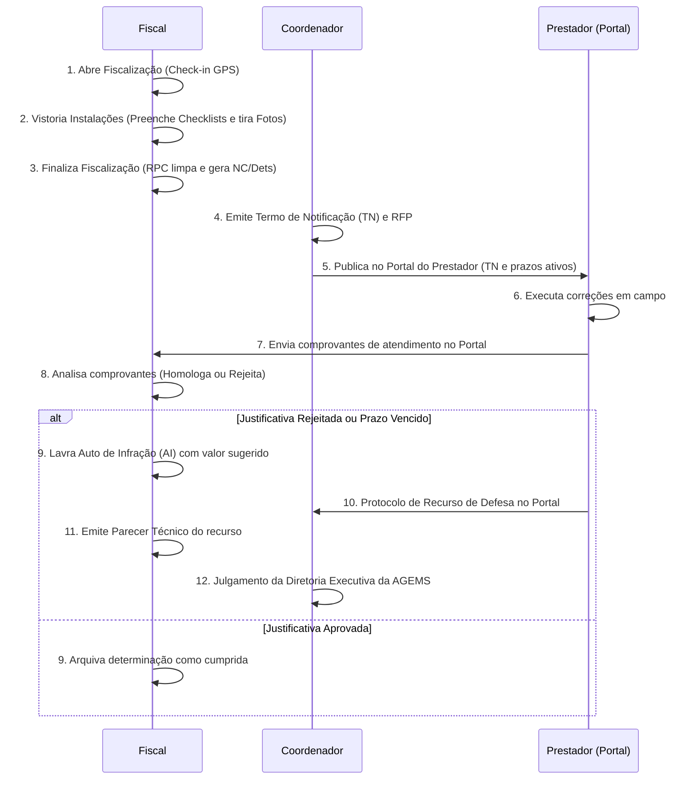

# 📖 Manual do Usuário - Sistema de Fiscalização AGEMS

Bem-vindo ao manual do usuário do **Sistema de Fiscalização de Saneamento e Regulação da AGEMS**. Este documento serve como guia didático e resolutivo para orientar fiscais, coordenadores e concessionárias (prestadores) em todas as fases das vistorias, acompanhamentos e aplicação de penalidades.

---

## 1. Perfis de Acesso e Escopo de Ação

O sistema controla o acesso de forma granular baseando-se no perfil de usuário:

*   **Coordenador / Administrador:** Acesso total. Realiza cadastros de apoio (Municípios, Prestadores, Tipos de Instalação e Checklists). Cria Termos de Notificação (TN), analisa recursos e emite julgamentos finais de penalidades. É o único perfil que pode reabrir fiscalizações finalizadas.
*   **Fiscal:** Perfil de campo e análise técnica. Abre vistorias, realiza o preenchimento de checklists em campo, insere constatações manuais, anexa fotos georreferenciadas e finaliza fiscalizações. Também audita as respostas das concessionárias e emite Pareceres Técnicos nos Autos de Infração.
*   **Prestador (Concessionária):** Perfil externo com acesso exclusivo ao **Portal do Prestador**. Visualiza os Termos de Notificação e Autos de Infração emitidos para sua empresa. Anexa comprovantes de atendimento de determinações e protocola recursos de defesa. Não tem acesso a dados de outras concessionárias.

---

## 🧭 2. O que é cada item no processo?

A regulação e a fiscalização baseiam-se em uma estrutura linear para garantir a rastreabilidade jurídica de cada infração:

```
[Fiscalização] ➔ [Unidade Fiscalizada] ➔ [Resposta checklist = NÃO / Manual] ➔ [Não Conformidade] ➔ [Determinação / Recomendação]
```

1.  **Fiscalização:** Pasta técnica de cabeçalho que agrupa todas as vistorias de campo de um município/prestador em uma determinada data.
2.  **Unidade Fiscalizada:** A instalação física específica vistoriada (ex: Estação de Tratamento de Esgoto - ETE "Los Angeles", Estação de Tratamento de Água - ETA "Guariroba").
3.  **Não Conformidade (NC):** Descumprimento técnico ou regulatório identificado (ex: Vazamento de lodo, falta de licença ambiental).
4.  **Determinação:** Exigência corretiva obrigatória. Toda determinação tem um prazo legal (ex: 30 dias) e, se não for cumprida, gera um Auto de Infração de forma automática.
5.  **Recomendação:** Orientação de boas práticas sugerida pelo fiscal (não gera auto ou multa).

---

## 🚀 3. Fluxo Operacional Recomendado

Siga o fluxo lógico abaixo para garantir a consistência das vistorias e evitar inconsistências contratuais:



---

## 📱 4. Operação em Campo e Modo Offline (Fiscais)

O aplicativo foi projetado com tecnologia **Offline-First**. Fiscais podem preencher checklists e registrar fotos em campo mesmo sem sinal de internet ou cobertura de dados.

### 📶 Como funciona o Modo Offline:
1.  **Abertura e Carga:** Antes de ir a campo, certifique-se de carregar a lista de fiscalizações abertas enquanto estiver conectado à internet.
2.  **Operação em Campo:** Você pode adicionar unidades, responder checklists, escrever constatações manuais e tirar fotos normalmente.
3.  **Outbox de Sincronização:** Todas as alterações ficam salvas na memória local do seu aparelho (IndexedDB) e são enfileiradas no **Outbox**. O contador de sincronização (indicador verde/amarelo no cabeçalho) exibirá o número de registros pendentes.
4.  **Auto-Sincronização:** Assim que o dispositivo restabelecer conexão (via Wi-Fi ou dados móveis), o sistema enviará a fila local de forma automática para o servidor PostgreSQL, preservando a ordem cronológica em que foram salvas.

### 📸 Registro de Fotos e Auditoria de Localização (Geo-Tagging)
*   Ao tirar uma foto pelo aplicativo, o sistema extrai os metadados **EXIF** (coordenadas de latitude/longitude e data/hora da captura) embutidos no arquivo de imagem pelo GPS interno do dispositivo.
*   Isso comprova juridicamente que o fiscal estava presente na instalação no momento do registro.

---

## 🏢 5. Fluxo de Sancionamento e Recursos (Autos de Infração)

Quando uma determinação é descumprida pela concessionária ou a justificativa de atendimento é rejeitada pelo fiscal:

1.  **Emissão de Auto (Fiscal):** Na tela da determinação vencida, clique em **Emitir Auto de Infração**. Informe o texto de enquadramento da multa e sugira o valor com base na tabela regulamentar. O sistema gerará o número oficial (ex: `AI 015/2026/DSB/AGEMS`).
2.  **Defesa do Prestador:** A concessionária terá o prazo legal para protocolar a petição de defesa técnica e anexar provas no Portal.
3.  **Parecer Técnico (Fiscal):** O fiscal responsável analisa a petição do prestador e emite o Parecer Técnico (mantendo a multa, alterando o valor ou cancelando o auto). O parecer é assinado digitalmente e anexado ao processo.
4.  **Julgamento Colegiado (Diretoria):** A Diretoria Executiva julga em última instância administrativa, anexando a certidão de julgamento e fixando o valor definitivo a ser pago ou arquivando o processo.

---

## 📊 6. Painel de Indicadores e Relatórios

Para obter dados estatísticos unificados do setor:
*   Acesse o painel **Relatórios e Indicadores**.
*   **Filtros de Seleção:** Utilize os seletores de multisseleção (Ano, Serviço, Município e Concessionária). O painel recalculará os gráficos e rankings de forma reativa e instantânea.
*   **Total de Vistoriadas:** O KPI global superior indica o total bruto de fiscalizações que coincidem com os filtros.
*   **Métricas Analíticas:** Os KPIs de Não Conformidades, Determinações, Recomendações e Conformidade Geral computam dados **exclusivamente de fiscalizações finalizadas** (`status = 'finalizada'`), garantindo que rascunhos em preenchimento não sujem os relatórios oficiais.
*   **Regra de Conformidade:** Exibida no painel gráfico através da subtração: `Conformidades = Constatações Totais - Não Conformidades`.

---

## 🛠️ 7. Resolução de Problemas Comuns (FAQ)

### 📸 Minha foto não tem GPS ou está apresentando erro de localização. O que fazer?
> [!WARNING]
> O sistema de auditoria exige coordenadas geográficas válidas nas fotos.
*   **Causa 1 (Permissões):** O navegador ou o aplicativo de câmera do seu dispositivo não tem permissão de acesso à "Localização". Vá nas configurações do aparelho, acesse as permissões do navegador (Chrome/Safari) e ative "Localização Precisa".
*   **Causa 2 (GPS inativo):** A localização do dispositivo está desligada. Ative o GPS na barra de notificações do aparelho.
*   **Causa 3 (Fotos da Galeria):** Se você fizer upload de uma foto que recebeu via aplicativos de mensagem (ex: WhatsApp), os metadados de GPS são deletados pelo aplicativo para proteção de privacidade. **As fotos devem ser tiradas diretamente pela câmera do aparelho no local vistoriado.**

### 🔄 Finalizei a fiscalização offline, mas o número do termo e os dados não aparecem no painel de relatórios.
*   **Causa:** Os dados estão salvos localmente e ainda não foram sincronizados com o servidor.
*   **Resolução:** Conecte o aparelho a uma rede Wi-Fi estável ou ligue os dados móveis. Verifique se o contador de "Outbox" (fila local) no topo da tela zerou. Assim que zerar, os dados estarão no servidor e os KPIs de relatórios serão atualizados de forma automática.

### 🔓 Como reabrir uma fiscalização finalizada incorretamente?
*   **Regra:** Apenas usuários com perfil de **Coordenador** ou **Admin** podem reabrir fiscalizações.
*   **Resolução:** Acesse a tela da fiscalização finalizada, clique em **Reabrir Fiscalização** (ícone de setas circulares). O sistema alterará o status de volta para `em_andamento`, apagará a fila de PDFs gerados anteriormente e permitirá a edição de checklists, inserção de novas fotos e unidades.

### 📤 O prestador alega que não visualiza o Termo de Notificação no portal.
*   **Causa:** O Termo de Notificação foi criado no banco, mas o arquivo PDF assinado não foi anexado ou o trâmite não foi salvo.
*   **Resolução:** Vá em **Gerenciar Termos**, localize o termo da fiscalização em questão e verifique o campo `status`. O termo só fica disponível no portal do prestador quando o status muda para `aguardando_resposta` (após o upload do TN em PDF assinado e preenchimento da data de protocolo de recebimento).

---

> [!TIP]
> **Dica de Campo:** Ao realizar vistorias em áreas rurais ou ETEs/ETAs afastadas onde a internet é inexistente, certifique-se de abrir o aplicativo no hotel ou escritório de manhã para atualizar as bases de checklists. Durante o dia, use o modo offline sem receios. Ao retornar à noite, conecte ao Wi-Fi para subir os dados de forma consolidada.
