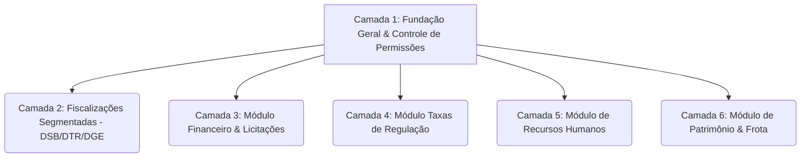

# Plano de Implementação: Expansão de Módulos Administrativos e Controle Modular - AGEMS

Este plano apresenta o cronograma técnico dividido em **Camadas/Módulos Independentes**. Primeiro estabelecemos as modificações estruturais (fundação de permissões) e, na sequência, isolamos o desenvolvimento de cada módulo administrativo. Dessa forma, a equipe pode decidir a ordem e quais módulos ativar.

---

## 🎯 Objetivo

Estender o ecossistema AGEMS com novos módulos corporativos (**Online-Only**), mantendo o módulo de Fiscalização original (**Offline-First**), sob um sistema dinâmico de permissões acumuladas por usuário.



---

## 🔍 Regras Gerais de Conectividade e Design (Validadas)

1. **Conectividade:** As Camadas 3, 4, 5 e 6 são estritamente **Online-Only**. Apenas a Camada 2 mantém o motor Offline-First (syncEngine.ts).
2. **RH (Folha de Pessoal):** Baseado na importação consolidada de arquivos PDF/JSON do sistema oficial do Estado.
3. **Logística (Frota & Manutenções):** Acompanhamento puramente financeiro/despesas de ordens de serviço executadas, sem controle físico de inventário de peças.
4. **Segurança (LGPD):** Tabelas sensíveis (RH, Ponto, Financeiro) protegidas por criptografia do banco de dados e políticas PostgreSQL RLS vinculadas a chaves de permissão.

---

## 🛠️ Detalhamento das Camadas de Implementação

---

### 🛡️ CAMADA 1: Fundação Geral & Autorização Dinâmica (Estrutural)

Esta camada é obrigatória e deve preceder todas as outras. Ela introduz a coluna de permissões e as chaves de acesso dinâmicas na interface e no banco de dados.

#### [NEW] 072_alter_profiles_add_permissions.sql
Adiciona a coluna `modulos_permitidos` na tabela de perfis de usuário, cria a lógica hierárquica no banco e realiza o seed inicial.

```sql
-- Adiciona coluna de módulos permitidos
ALTER TABLE public.profiles ADD COLUMN IF NOT EXISTS modulos_permitidos TEXT[] DEFAULT '{}'::text[];

-- Helper SQL para checagem de permissão com suporte hierárquico
CREATE OR REPLACE FUNCTION public.check_user_module_access(user_id UUID, required_perm TEXT)
RETURNS BOOLEAN AS $$
DECLARE
    v_role TEXT;
    v_perms TEXT[];
    v_perm TEXT;
BEGIN
    SELECT role, modulos_permitidos INTO v_role, v_perms
    FROM public.profiles
    WHERE id = user_id;

    -- Admins têm acesso automático a tudo
    IF v_role = 'admin' THEN
        RETURN TRUE;
    END IF;

    -- Verifica se a permissão exata existe
    IF required_perm = ANY(v_perms) THEN
        RETURN TRUE;
    END IF;

    -- Suporte à hierarquia de permissão (ex: ter 'fiscalizacao:dsb' concede acesso a 'fiscalizacao:dsb:catesa')
    FOREACH v_perm IN ARRAY v_perms LOOP
        IF required_perm LIKE v_perm || '%' THEN
            RETURN TRUE;
        END IF;
    END LOOP;

    RETURN FALSE;
END;
$$ LANGUAGE plpgsql SECURITY DEFINER;

-- Semente inicial para usuários existentes baseado no cargo histórico, diretoria e câmara técnica
UPDATE public.profiles 
SET modulos_permitidos = ARRAY[
    'fiscalizacao:' || diretoria_id || CASE WHEN camara_tecnica_id IS NOT NULL THEN ':' || camara_tecnica_id ELSE '' END
]
WHERE role IN ('fiscal', 'coordenador', 'user') AND diretoria_id IS NOT NULL;

-- Garante que admins continuem com acesso total
UPDATE public.profiles 
SET modulos_permitidos = ARRAY[
    'fiscalizacao:dsb', 'fiscalizacao:dtr', 'fiscalizacao:dge',
    'financeiro', 'rh', 'logistica', 'taxas_regulacao'
]
WHERE role = 'admin';
```

#### [MODIFY] AuthContext.jsx
Integração do array `modulos_permitidos` no objeto de usuário autenticado do React e exposição da função utility `hasModuleAccess(requiredPerm)`.

#### [MODIFY] Layout.jsx
Modificação da navegação lateral (Sidebar) para exibir as seções e links do menu dinamicamente conforme os retornos da função `hasModuleAccess()`.

#### [MODIFY] GerenciarUsuarios.jsx
Aprimoramento da tela de gestão de usuários, adicionando seletor em acordeão com checkboxes para definir e acumular as permissões de cada servidor da agência.

---

### 📋 CAMADA 2: Fiscalização Segmentada (DSB / DTR / DGE)

Adaptação do módulo de vistorias de campo existente para as novas restrições de permissão por diretoria e por Câmara Técnica.

#### [MODIFY] Script de Migração SQL (Políticas RLS em `fiscalizacoes`)
Substituição das regras de acesso rígidas para consultas baseadas no vetor `modulos_permitidos` do usuário ativo. Fiscais só visualizam as vistorias correspondentes às diretorias ou câmaras marcadas em seu perfil.

---

### 💵 CAMADA 3: Módulo Financeiro & Licitações (Online-Only)

Focado na gestão de receitas corporativas, despesas gerais, certames licitatórios e contratos administrativos de fornecedores da agência.

#### [NEW] 073_financeiro_e_licitacoes.sql
Criação das tabelas e vinculação de políticas RLS ao módulo `'financeiro'`.
* Tabelas: `contas_financeiras`, `transacoes_financeiras`, `licitacoes`, `contratos_administrativos`.

#### [NEW] Telas do Financeiro:
* `src/pages/financeiro/DashboardFinanceiro.jsx`: Balanço mensal consolidado, entradas vs. saídas e alertas de vigência.
* `src/pages/financeiro/ContratosAdministrativos.jsx`: Registro, controle de aditivos e datas de reajuste.

---

### 🏷️ CAMADA 4: Módulo Taxas de Regulação (Online-Only)

Gestão de cobranças das taxas institucionais devidas por prestadoras de serviços públicos regulados e municípios.

#### [NEW] 074_taxas_regulacao.sql
Criação das tabelas de taxas e vínculos RLS às permissões `'taxas_regulacao'` ou `'financeiro'`.
* Tabelas: `empresas_reguladas`, `taxas_regulacao`.

#### [NEW] Telas de Cobrança:
* `src/pages/financeiro/TaxasRegulacao.jsx`: Painel de lançamento mensal por competência, envio manual de PDFs de boletos e upload de comprovantes de pagamento para auditoria.

---

### 👥 CAMADA 5: Módulo de Recursos Humanos - RH (Online-Only)

Gestão da ficha cadastral dos servidores públicos, folha financeira simplificada e controle de horários.

#### [NEW] 075_recursos_humanos.sql
Criação das tabelas de pessoal com chaves RLS atadas ao módulo `'rh'`.
* Tabelas: `colaboradores`, `registro_ponto`, `folhas_pagamento`.

#### [NEW] Telas de RH:
* `src/pages/rh/Colaboradores.jsx`: Ficha funcional contendo dados de admissão e cargo.
* `src/pages/rh/DashboardRH.jsx`: Resumo estatístico do quadro de servidores.
* `src/pages/rh/RegistroPontoAdmin.jsx`: Visão de espelho de ponto para lançamento de justificativas e atestados.

---

### 🚚 CAMADA 6: Módulo de Patrimônio & Frota (Online-Only)

Controle físico de bens tombados da agência e gastos detalhados com combustível e manutenções de veículos oficiais.

#### [NEW] 076_patrimonio_e_logistica.sql
Criação das tabelas de logística com regras RLS atadas à permissão `'logistica'`.
* Tabelas: `bens_patrimoniais`, `veiculos`, `abastecimentos`, `manutencoes_veiculo`.

#### [NEW] Telas de Logística:
* `src/pages/logistica/FrotaVeiculos.jsx`: Cadastro da frota e histórico de odômetro.
* `src/pages/logistica/Abastecimentos.jsx`: Registro de gastos de combustível.
* `src/pages/logistica/Patrimonio.jsx`: Listagem física de bens móveis e eletrônicos e responsáveis.

---

## 🧪 Plano de Verificação por Camada

A equipe poderá testar a conformidade de cada camada de forma estanque:
* **Teste da Camada 1:** Alterar as permissões de um usuário no gerenciador e confirmar se os links do menu lateral somem/aparecem imediatamente na tela e se o acesso manual às rotas é bloqueado.
* **Teste das Camadas 3 a 6:** Desativar a rede do navegador (Offline) e confirmar que o sistema avisa de forma amigável que aquela área necessita de internet ativa para acesso, mantendo a integridade dos dados corporativos.
